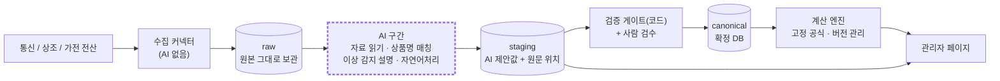

# 모두온 AI 이식 계획 — 요약본

> **원칙: AI는 수집·정리를 맡고, 계산은 고정 공식이 한다.**
> AI 출력은 `staging`(임시 테이블)에서 멈춥니다. 코드 검증과 사람 승인을 거친 값만 확정 DB로 들어가고, 계산 엔진은 확정 DB만 읽습니다.

상세 설계(DDL, JSON Schema, 상태 전이, 권한, 화면별 설계, 비용 계산 근거)는 [`ai-integration-plan.md`](./ai-integration-plan.md)에 있습니다. 이 문서는 그 요약입니다.

AI가 하는 일을 화면 없이 직접 돌려 보는 시연 프로그램은 [`demo/moduon-ai-demo`](../../demo/moduon-ai-demo/README.md)에 있습니다.

---

## 0. 전제

- 노션 작업 규칙, 디자인 파운데이션(moduon-components), v2(/cars) 링크는 작성 환경의 네트워크 정책 때문에 **열어보지 못했습니다.** Vercel에 배포돼 있으므로 Next.js라고 가정했고, 화면 설계는 일반 컴포넌트 이름(Table, Badge, Drawer 등)으로 적었습니다. 실제 파운데이션과 대조하는 작업은 "이번 주 할 일" 4번입니다.
- 백엔드와 DB는 새로 만듭니다. 팀은 개발 1~3명으로 가정했습니다.
- '계산 로직'은 **둘 다**로 보입니다: 휴대폰 요금 설계(고객 월 납부액)와 리베이트(정산). 아래 0-1 참고. 정확한 공식은 여전히 확인해야 합니다.

## 0-1. 추가로 확인된 요구사항 (2026-09-27)

- **핵심 가치:** 흩어져 있는 전산을 알아서 모으는 것. 출고가·모델명·공시지원금·요금제별 리베이트·기타 조건을 한곳에.
- **휴대폰 요금 설계 화면에 리베이트 표시:** 요금제(가격대)마다, 가입유형(번호이동·기기변경)마다 리베이트가 몇 개(1개 = 1만원)인지.
- **사업 구조:** 모두온 → 총판 → 대리점 → 셀러. 모든 UI(전산)를 통일하고, 이를 **분양몰**로 대리점에 분양합니다(대리점이 주 고객).
- **몰에 넣을 상품군:** 통신 3사의 모바일, 인터넷(+TV), 유심, 렌트·리스, 렌탈.
- **규제:** 인터넷(+TV)은 페이백(경품) 한도가 있습니다. 참고로 휴대폰 단말기유통법(단통법)은 2025년 7월 폐지된 것으로 알고 있고, 인터넷·TV 경품 기준은 전기통신사업법·방통위 기준 쪽입니다. 현재 기준은 법무 확인이 필요합니다.

설계에 주는 영향:

1. **리베이트 배분과 노출:** 통신사 원천 리베이트에서 총판·대리점이 떼고 셀러에게 가는 금액을 **고정 공식(배분 정책)**으로 계산합니다. 역할마다 보이는 금액이 다르고, 고객에게는 보이지 않습니다. AI는 배분 계산에 관여하지 않습니다.
2. **분양몰 = 멀티테넌트:** 대리점(몰)별 데이터 분리, 역할(모두온·총판·대리점·셀러)별 권한이 필요합니다. 원천 정책 수집은 모두온이 한 번 하고, 각 몰은 그 위에 자기 정책만 얹습니다.
3. **정책 변경 빈도:** 리베이트는 하루에도 여러 번 바뀝니다. 확정 이력을 월 단위가 아니라 **적용 시각** 단위로 관리해야 합니다.
4. **상품군별 필드 사전·규칙:** 인터넷은 약정·결합·경품, 렌트·리스는 기간·보증금·잔존가치처럼 항목이 다릅니다. 경품 한도는 규칙(block)으로 넣습니다.
5. **범위가 크게 늘었습니다.** 기존 로드맵(5장)과 견적은 모바일 한 상품군 기준이라 다시 산정해야 합니다.

시연 프로그램은 이 요구에 맞춰 통신 3사(엑셀·카톡·API·CSV) → 요금 설계 화면(셀러/고객 전환, 요금제×가입유형별 리베이트)까지 보여 줍니다.

## 1. 전체 구조

계산 엔진으로 가는 경로에는 AI가 없습니다. 이 경계는 앱 코드가 아니라 **DB 권한**(컬럼 GRANT, 트리거, 정해진 승인 함수)으로 강제합니다.

## 2. AI가 하는 일, 하지 않는 일

| 기능 | AI가 하는 일 | AI가 하지 않는 일 |
|---|---|---|
| ① 자료 읽기 | 새 엑셀 양식의 헤더 → 표준 필드 매핑 **제안**. PDF·이미지 정책표에서 값과 원문 위치(페이지·행·열)를 옮겨 적기 | 합계·할인가 계산, 원문에 없는 값 추론, 적용일·조건 확정 |
| ② 상품명 매칭 | 코드가 뽑은 후보 10개 중에서 고르기, 또는 "해당 없음 / 신규 상품 / 애매함" 판정 | 후보에 없는 ID 만들기, 매칭 확정 |
| ③ 이상 감지 | 규칙·통계가 잡은 건의 원인을 분류하고 설명 문장 쓰기(숫자는 코드가 채움) | 이상인지 판단, 심각도 결정, 차단 해제 |
| ④ 자연어처리 | 공지·메일 본문 → 변경 사항 구조화. (선택) 관리자 질문 → 조회 조건 | SQL 생성, 데이터 쓰기, 숫자 요약 |

매칭은 **정확 일치 → 정규화 규칙 → 유사도(pg_trgm) → AI 판정** 순서로 갑니다. 사람이 승인한 이름은 alias 사전에 쌓여서 다음부터는 규칙 단계에서 끝납니다. 그래서 시간이 지날수록 AI 호출이 줄어듭니다.

## 3. 핵심 안전장치

1. **원문 대조.** AI가 뽑은 값은 코드가 원문의 해당 셀·문장과 대조합니다. 맞지 않으면 승인 버튼이 비활성화됩니다. 신뢰도는 모델이 스스로 말한 확신도가 아니라 코드 검증 결과로 정합니다.
2. **DB 권한 방화벽.** AI 워커는 추출값 컬럼만 쓸 수 있고, 상태·승인 컬럼은 바꿀 수 없습니다. 계산 엔진 롤은 `staging`을 볼 수 없습니다. 이 규칙을 지키는지 권한 음성 테스트를 CI에서 돌립니다.
3. **계산은 코드로 고정.** `calc/` 패키지에 순수 함수로 두고 버전으로 관리합니다. 작성자와 승인자가 달라야 합니다. 과거 정산서와 1원 단위까지 맞추는 골든 테스트를 통과해야 배포됩니다. `calc/`는 AI SDK를 import할 수 없습니다.
4. **조건별 단가.** 가입유형·약정·요금제·결합에 따라 달라지는 값을 `condition_key`로 나눠 저장합니다. 조건 문구 해석은 규칙 사전이 하고, 사전에 없는 문구가 나오면 반영을 멈춥니다.
5. **개인정보·인젝션.** PII 스캔을 통과한 파일만 LLM에 보냅니다. 문서 안의 지시문은 데이터로 취급합니다(프롬프트 인젝션 방어). 해외 API로 보내는 부분(국외이전)은 **법률 검토가 필요합니다.**

## 4. 기술 스택

| 계층 | 1안 (백엔드 개발자가 있을 때) | 2안 (디자이너 단독) |
|---|---|---|
| 관리자 화면 | Next.js(Vercel) + 모두온 디자인 파운데이션 | 같음 |
| DB·인증·파일 | Supabase(서울 리전): Postgres + pg_trgm | 같음 |
| 워커(수집·AI) | Python + `anthropic` SDK. 큐는 DB 테이블 | TypeScript + `@anthropic-ai/sdk` + Trigger.dev/Inngest |
| 계산 엔진 | Python `calc/`(정수·Decimal) | TypeScript `calc/`(bigint) |

MVP에는 별도 API 서버를 두지 않습니다. 화면과 워커는 DB 테이블로만 주고받습니다.

## 5. 로드맵

| Phase | 기간(가정) | 범위 | 완료 기준 |
|---|---|---|---|
| **0 사전조사** | 3~4주 | 전산별 샘플 파일 확보, 계산식 명세, **초기 상품 마스터 구축**, 첫 전산 골든셋, 법률 검토 요청 | 첫 전산 확정, 계산 범위 확정, 첫 전산 상품의 90% 이상 마스터 등록 |
| **1 MVP** | 개발 2명 8~10주 / 1명 12주+ / 디자이너 단독 14~20주 | 엑셀 전산 **1개**, 수동 업로드, AI는 헤더 매핑 제안 + 상품 매칭만, **자동 반영 0%**(전건 사람 승인), 검수 큐·상품 매칭·수집 현황 화면 | 필드 정확도 ≥95%, 매칭 top-1 ≥90%, 계산 결과가 수작업과 1원 단위까지 100% 일치 |
| **2 확장** | 8~12주 | 나머지 전산, PDF·스캔 추출, 이상 감지(통계 + AI 설명), 공지 구조화, AI를 쓰지 않은 경로만 조건부 자동 반영 | 전산 3개 운영, 검수 시간 -50% |
| **3 고도화** | 4~6주 | (선택) 자연어 조회, 계산식 시뮬레이션, 골든셋 기준을 넘은 AI 경로의 조건부 자동 반영, Batch API | 금액 오류 0, 자동 반영률 20% → 50% |

신규 상품, 정산 단가 변경, 스캔본 금액, 이메일로 받은 파일은 **어느 단계에서든 사람이 승인**합니다.

## 6. 모델과 비용 (가정)

- **결정(2026-09): 시연과 1차 운영 모델은 `claude-haiku-4-5`($1 / $5 per 1M 입력/출력 토큰)입니다.**
  - Haiku 4.5는 `effort` 파라미터를 받지 않습니다. 대신 thinking 예산으로 추론 깊이를 조절합니다. 단순 작업은 thinking을 끄고, PDF 추출만 예산 2,048토큰을 씁니다.
  - 구조화 출력(JSON Schema)은 그대로 씁니다.
  - 프롬프트 캐시 최소 길이가 4,096토큰이라, 짧은 프롬프트는 캐시되지 않습니다.
- **상위 모델은 비교해 보고 필요한 곳에만 씁니다.** `claude-sonnet-5`($2/$10)와 `claude-opus-5`($5/$25)를 같은 골든셋으로 돌려 비교합니다(시연의 `./run.sh compare`).
  - 스캔본 PDF나 애매한 매칭처럼 Haiku가 부족한 과제가 나오면, 코드 검증에서 등급이 `low`인 건만 상위 모델로 다시 판정하는 방식을 검토합니다.
- Batch API(50% 할인)는 월 비용이 $200을 넘을 때 도입합니다.
- 월 API 비용 추정(아래는 Opus 5 단가 기준 계산입니다. Haiku 4.5는 토큰당 단가가 1/5입니다):
  - Opus 5 기준: Phase 1 약 $3 / Phase 2 약 $140 / Phase 3 약 $270~485(배치 적용 여부에 따라)
  - 캐시 할인은 넣지 않은 보수적 추정이고, 추출 스파이크에서 실측해 바꿉니다.
- 초기에는 API 비용보다 **사람 검수 시간**이 더 큽니다(Phase 1 월 약 6시간, Phase 2 월 약 33시간 → 자동화로 절반 목표).

## 7. 클라이언트에게 먼저 물을 것

1. 각 전산이 데이터를 어떤 형태로 주는지(API/엑셀/PDF/웹 화면), 최근 3개월 샘플 파일
2. '계산 로직'이 정산인지, 고객 가격인지, 둘 다인지. 계산식 문서와 반올림 규칙
3. 표준 상품 마스터가 이미 있는지
4. 검수·승인할 사람이 최소 2명인지
5. 데이터에 개인정보가 들어 있는지. 고객 개인 단위 데이터도 범위에 넣는지
6. '자연어처리'가 공지·메일을 구조화하는 것인지, 관리자가 자연어로 조회하는 것인지, 둘 다인지
7. 가격이 어떤 조건(가입유형·약정·요금제·결합)에 따라 달라지는지
8. 자동차(/cars) 카테고리도 범위에 들어가는지
9. 리베이트 배분 규칙: 총판·대리점·셀러가 각각 얼마를 떼는지, 셀러에게 보여 줄 금액, 부가서비스 미유지 시 환수 규칙
10. 리베이트 정책이 하루에 몇 번 바뀌는지, 적용 시각을 어떻게 알리는지(카톡·문자·전산 공지)
11. 분양몰 구조: 대리점마다 몰을 따로 두는지, 셀러가 몇 명인지, 대리점이 자기 정책을 얹는지

전체 19개 질문은 상세 문서 12장에 있습니다.

## 8. 이번 주 할 일

1. 위 질문과 샘플 파일, 과거 정산서·견적서 30건을 클라이언트에게 요청합니다.
2. 계산 로직 정의 워크숍을 잡습니다.
3. 법률 검토 요청서를 만듭니다(국외이전, 스크래핑, 고객 노출 가격).
4. 링크 3종을 대조합니다. 노션 작업 규칙과 저장소 구조가 충돌하는지, Next.js 버전과 스타일링 방식, 파운데이션 컴포넌트가 있는지 확인합니다.
5. Supabase 프로젝트와 migration `0001`(스키마, 권한, 트리거)을 만들고, 권한 음성 테스트를 먼저 씁니다.
6. 추출 스파이크: 샘플 엑셀·PDF 몇 개로 프롬프트 v1을 돌려서 토큰과 정확도를 실측합니다.
7. 초기 상품 마스터 구축을 시작합니다.
8. 검수 큐 와이어프레임을 파운데이션 컴포넌트로 옮깁니다.
